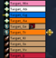

# TBC World of Warcraft Classic: BattlegroundTargets AddOn
A Friend-Enemy-Unit-Frame for battlegrounds. [¹]

Forum:
http://forums.wowace.com/showthread.php?t=19618

Download: (NO JavaScript required)
http://www.wowace.com/addons/battlegroundtargets/files/

## Usage
* Download this repo (Google how to use GitHub if unfamiliar)
* Unzip file
* Copy/Paste uncompressed directory to the file location: `C:\Program Files (x86)\World of Warcraft\_classic_\Interface\AddOns`
* Exit/Enter game
* ???
* Profit

## Known Issues
| ID  | Description | Severity | Status |
|-----|-------------|----------|--------|
| 001 | None currently reported | N/A | N/A |

## To Do
* Nothing to do...

<!-- Source Links -->
[¹]: <https://www.curseforge.com/wow/addons/battlegroundtargets> (CurseForge: BattlegroundTargets)
